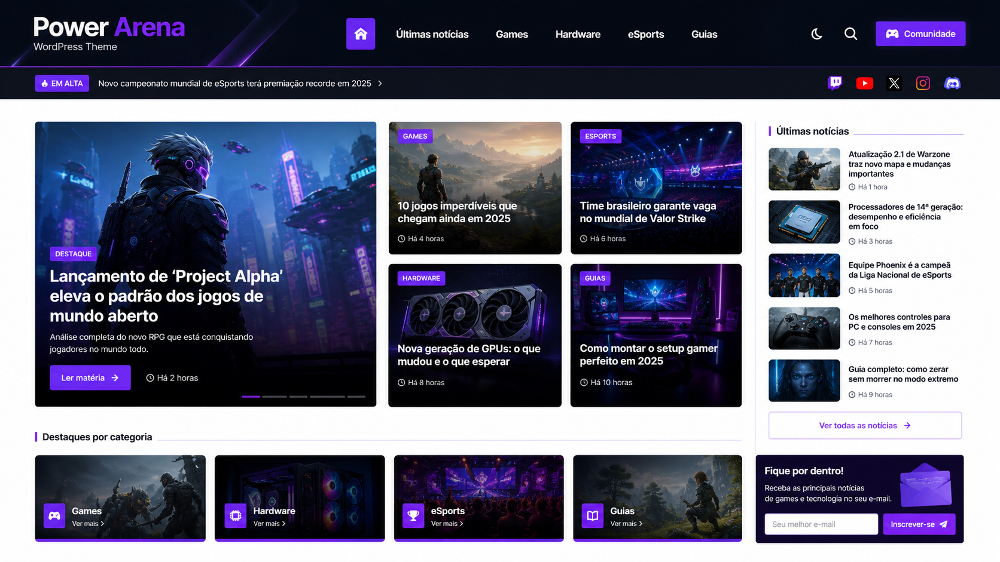
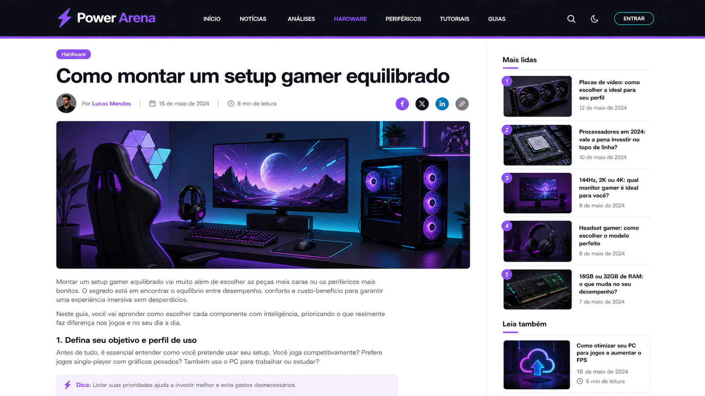

# Power Arena - WordPress Theme

Tema WordPress editorial para portais de games, eSports, hardware e
tecnologia. O Power Arena combina uma estrutura de revista digital com foco
em desempenho, acessibilidade, SEO técnico e compatibilidade com o ecossistema
WordPress.

> Este repositório contém o tema e o tema filho. As imagens desta documentação
> são prévias ilustrativas da identidade Power Arena; para validar a instalação
> em produção, siga o fluxo de build e deploy descrito abaixo.

## Prévia visual

### Página inicial



### Página de artigo



As prévias representam a direção visual do tema e não substituem a validação
com o conteúdo, plugins, menus e imagens do projeto que será publicado.

## Visão geral

O tema foi pensado para sites editoriais que precisam publicar conteúdo com
frequência sem abrir mão de uma base técnica organizada. Ele oferece:

- página inicial modular para destaques, categorias e últimas notícias;
- templates para artigos, páginas, arquivos, busca, anexos e 404;
- cards editoriais reutilizáveis e layouts de uma ou duas colunas;
- menus principal, superior, responsivo e rodapé;
- sidebar configurável e suporte a widgets;
- Customizer nativo para logo, cor de destaque, fonte e sidebar;
- integração opcional com ACF Options Page;
- compatibilidade com WPBakery, Yoast SEO e wpDiscuz;
- pipeline de CSS/JavaScript com Vite e manifest de produção;
- fontes locais, preload seletivo e cuidados com Core Web Vitals;
- suíte de testes PHPUnit executável no ambiente `wp-env`.

## Pré-requisitos

- **Docker Desktop** (para o `wp-env`, que sobe WordPress + MySQL + PHP em
  contêineres — nenhuma instalação local de PHP/MySQL é necessária).
- **Node.js 20.19+ ou 22.12+** e npm (para o pipeline de assets — Vite).

## Ambiente local (`wp-env`)

O ambiente de desenvolvimento/teste roda inteiramente via
[`@wordpress/env`](https://www.npmjs.com/package/@wordpress/env)
(`wp-env`), instalado como dependência de desenvolvimento e configurado por
`.wp-env.json` (versão do WordPress/PHP e o
tema em si, montado como o tema ativo) e `.wp-env.override.json` (plugins
extras não versionados no `.wp-env.json` público — ACF, Yoast SEO,
wpDiscuz, WPBakery `js_composer`; overrides locais como tokens de preview,
ver GAP G abaixo). Instale as versões fixadas no lockfile:

```bash
npm ci
```

**A partir desta mesma pasta** (`wp-content/themes/arena/` — é aqui, e não
na raiz da instalação WordPress, que vive o `.wp-env.json`; `wp-env`
resolve a configuração subindo a árvore de diretórios a partir do cwd. Os
`mappings` fixam os slugs `arena` e `arena-child`, independentemente do nome da
pasta usada no clone):

```bash
npm run env:start   # sobe os containers; primeira vez baixa as imagens (pode demorar)
npm run env:seed    # cria conteúdo local idempotente para validar o tema
npm run env:stop    # para os containers (mantém os dados)
npm run env:destroy # remove os containers E os dados (recomeça do zero)
```

URLs e credenciais padrão do `wp-env`:

| Ambiente | URL                     | Usuário | Senha    |
|----------|-------------------------|---------|----------|
| Site     | http://localhost:8888   | admin   | password |
| Admin    | http://localhost:8888/wp-admin | admin | password |
| Testes   | http://localhost:8889   | admin   | password |

No Windows, comandos que passam caminhos estilo Unix para dentro do
container (ex.: `--env-cwd=wp-content/themes/arena`) precisam do prefixo
`MSYS_NO_PATHCONV=1` no Git Bash, para que o Bash não tente "corrigir" o
caminho para um caminho Windows antes de repassá-lo ao Docker.

## Pipeline de assets (Vite)

CSS/JS do tema vivem em `assets/src/` (`css/main.css`, `js/main.js`) e são
buildados com [Vite](https://vitejs.dev/) para `assets/dist/`
(**gitignored** — nunca commitar `assets/dist/`; é gerado no deploy/CI, não
no repositório).

```bash
npm install     # uma vez, instala vite + lighthouse (devDependencies)
npm run dev     # vite em modo dev (dev server, não usado pelo PHP em produção)
npm run build   # build de produção -> assets/dist/ + assets/dist/.vite/manifest.json
```

`Arena\Assets::enqueue()` (`inc/Assets.php`) lê `assets/dist/.vite/manifest.json`
para resolver o hash do arquivo JS/CSS de produção atual e enfileirar os
`<link>`/`<script>` corretos — **sem esse manifest (build não executado),
`Assets::enqueue()` degrada silenciosamente para não enfileirar nada** (não
gera fatal, mas a página sobe sem o CSS/JS do tema). Rode `npm run build`
sempre antes de verificar visualmente uma mudança.

## Testes (PHPUnit via `wp-env`)

```bash
MSYS_NO_PATHCONV=1 wp-env run tests-cli --env-cwd=wp-content/themes/arena vendor/bin/phpunit
```

**Quirk conhecido:** quando a suíte tem alguma falha (RED), o `wp-env run`
frequentemente imprime a saída do PHPUnit **truncada/embaralhada** no
terminal (um problema de buffering do `docker exec` sob Windows/Git Bash,
não do PHPUnit em si) — a mensagem de erro real pode aparecer cortada ou
fora de ordem. **Não confie no texto da mensagem para julgar
verde/vermelho**; confie no **exit code** do comando (`$?` — `0` é verde) e
na contagem de `Tests:`/`Assertions:`/`Failures:` que aparece no final,
mesmo que o corpo de uma falha específica tenha saído ilegível. Se
precisar ver o detalhe de uma falha específica, rode só aquele arquivo
(`vendor/bin/phpunit tests/NomeDoTeste.php`) para reduzir o volume de saída
embaralhada.

## Arquitetura

- `functions.php` — define constantes (`ARENA_DIR`, `ARENA_URI`), registra
  um autoloader PSR-4 simples (`Arena\Foo\Bar` → `inc/Foo/Bar.php`) e chama
  `Arena\Theme::boot()`.
- `inc/Theme.php` — ponto único de boot; registra todos os módulos abaixo.
- `inc/Setup.php` — theme supports, menus, sidebars, `body_class` do shell
  2-colunas, `load_theme_textdomain()`.
- `inc/Assets.php` — enfileiramento de CSS/JS via manifest do Vite,
  `<link rel=preload>` da fonte crítica + bloco `:root{…}` inline (ver
  seções "Fontes" e "Painel de opções" abaixo), correção de `sizes` de
  imagens lazy-loaded.
- `inc/Layout.php` — mapeia uma chave de layout (`2col-right`, `2col-left`,
  `1col`) para as classes CSS das colunas do shell (`template-parts/layout/`).
- `inc/Pagination.php` — paginação (`paginate_links` com `type: 'plain'`).
- `inc/Preview.php` + `mu-plugins/arena-preview.php` — preview do tema em
  produção sem alterar o tema ativo (ver seção própria abaixo).
- `inc/Customizer.php` — painel nativo do Customizer (**principal** forma de
  configurar o tema, sem plugins) + `inc/OptionsPanel.php` (painel ACF,
  opcional) + `inc/Options.php` (leitor único, resolve
  theme_mod → ACF → default) — ver seção "Onde configurar o tema" abaixo.
- `inc/Compatibility.php`, `inc/Blocks/` — camada de compatibilidade com
  WPBakery (`Blocks\VcMap`, `Blocks\SingleImageHeading`,
  `Blocks\Accordions`) e os shortcodes `[bs-*]` próprios
  (`Blocks\Shortcodes`), que são a "engine de listagem" do tema:
  **`Arena\Listing\Query` → `Arena\Listing\Renderer` → `template-parts/listing/*.php`**.
  `Query::args()` é uma função pura que mapeia atributos de shortcode para
  args de `WP_Query`; `Renderer::render()` executa a query e delega a
  marcação para o layout certo (`grid`, `mix`, `blog`, `modern-grid[-1]`,
  `archive`) em `template-parts/listing/` e aos cards em
  `template-parts/card/` (`hero`, `featured`, `list`, `text`), todos
  compartilhando o partial `card/meta.php` para o bloco `.post-meta`
  (autor/data/comentários).
- `inc/Menus/MegaMenuWalker.php` — walker de menu customizado para o mega
  menu + menu off-canvas mobile.
- Templates na raiz (`front-page.php`, `single.php`, `page.php`,
  `archive.php`, `search.php`, `404.php`, `attachment.php`, `comments.php`)
  + `template-parts/` — a marcação propriamente dita, reproduzida
  clean-room a partir da referência medida (não copiada do Publisher).
- `assets/src/css/main.css` inteiro vive dentro de `@layer base, components,
  utilities;`. Isso é uma escolha deliberada, não um acidente — mas tem uma
  consequência que já mordeu este tema antes: QUALQUER stylesheet de plugin
  que não declare seus próprios `@layer` (js_composer/WPBakery, entre
  outros) fica automaticamente acima de `main.css` na cascata, não importa
  a especificidade do seletor — CSS não-camadeado sempre vence sobre CSS
  camadeado. É por isso que algumas regras contra o `js_composer` neste
  arquivo precisam de `!important`: não é especificidade insuficiente, é a
  ordem das camadas. Ver o comentário equivalente no topo de
  `assets/src/css/main.css`.

## Onde configurar o tema (Customizer — **sem plugins**)

**A partir de `task-native-settings`, o Customizer nativo do WordPress é o
lugar PRINCIPAL para configurar o Arena** — funciona com zero plugins, ao
contrário do painel ACF abaixo (que continua existindo como um extra
opcional, mas ACF **não está instalado em produção**, o que antes deixava o
tema sem NENHUMA UI de configuração: "não achei onde altero configurações do
tema, como adicionar a logo").

- **Logo:** *Aparência → Personalizar → Identidade do site* (`custom_logo`,
  suporte nativo do WordPress — `add_theme_support('custom-logo', …)` em
  `Arena\Setup::themeSupports()`). Envie a versão em alta resolução (2×) do
  logo (a arte de referência do tema é 640×140; o header renderiza a logo a
  ~64px de altura). `flex-height`/`flex-width` estão ativos, então qualquer
  proporção razoável funciona — os 640×140 são só a proporção-guia usada
  pelo cropper da biblioteca de mídia.
- **Cor de destaque / posição da sidebar / fonte base:** *Aparência →
  Personalizar → **Arena*** (`inc/Customizer.php`, `Arena\Customizer`,
  registrado em `customize_register`). Painel próprio, com uma seção
  "Opções do Arena" contendo os 3 controles, cada um com sua própria
  descrição explicando o efeito.

**Precedência (`inc/Options.php`, ver docblock de cada getter):**
`theme_mod` (Customizer, PRIMÁRIO) → opção ACF (só se o plugin estiver ativo
e o campo tiver um valor) → valor padrão do tema. Isso vale para os 4
valores (`logoId()`/`accentColor()`/`sidebarLayout()`/`baseFont()`, e por
extensão `cssTokens()`) — testado em `tests/OptionsTest.php` (theme_mod
definido vence; só ACF definido usa o ACF; nenhum dos dois usa o default).
A garantia de contraste acessível (`Options::accessibleTextColor()`) se
aplica **igualmente** a uma cor escolhida no Customizer e a uma escolhida no
painel ACF — ambos os caminhos convergem em `Options::cssTokens()` antes de
qualquer coisa ser impressa (ver `tests/OptionsTest.php::test_css_tokens_derive_accessible_text_from_theme_mod_accent`).

- **Menus:** *Aparência → Menus*. Locais registrados: `main-menu`,
  `top-menu`, `resp-menu` (compatíveis com o Publisher, herdam as
  atribuições existentes na migração) + `footer-menu` (opcional — só usado
  pelo rodapé quando algo é de fato atribuído a ele; sem atribuição, o
  rodapé continua usando `main-menu`, como sempre fez — ver
  `Arena\Setup::footerMenuLocation()`).
- **Widgets:** *Aparência → Widgets* → área **Sidebar Principal**
  (`arena-primary`). **Atenção na migração:** ver DEPLOY.md — os widgets do
  Publisher vivem em outra área (`primary-sidebar`) e **não são migrados
  automaticamente**.

Sem nenhuma notificação/nag no admin — a descoberta é só via a própria
navegação do Customizer (seções com descrição) e esta documentação.

## Painel de opções (ACF Options Page — opcional)

`inc/OptionsPanel.php` registra uma página de opções ACF
(`acf_add_options_page`, slug `arena-options`, capability
`edit_theme_options`) com 4 campos (`inc/OptionsPanel::fields()`, puro e
testável): logo, cor de destaque, fonte base e posição da sidebar.
Requer o plugin **Advanced Custom Fields** ativo; sem ACF, `OptionsPanel::boot()`
retorna sem fazer nada (`function_exists('acf_add_options_page')` guard) —
não fatala. **Mantido como uma alternativa/complemento para sites que já têm
ACF instalado** — o Customizer (seção acima) é o caminho principal e
funciona sem ele. Os valores dos dois painéis são lidos pelo mesmo
`inc/Options.php`, com o Customizer tendo prioridade (ver precedência acima).

**Os 4 campos são todos efetivamente aplicados** (revisão
`task-review-fixes-3`; antes só a logo era lida por algum template):

- **Cor de destaque** (`arena_accent_color`) e **fonte base**
  (`arena_base_font`, whitelist `barlow-oswald`/`system` — não um seletor de
  família livre, que exigiria auto-hospedar qualquer fonte digitada) são
  lidos por `Arena\Options::cssTokens()` e impressos como um bloco
  `<style id="arena-inline-tokens">:root{…}</style>` inline no `wp_head`
  (`Arena\Assets::printInlineTokens()`), sobrepondo os valores padrão de
  `main.css` via ordem no `<head>` (mesma especificidade CSS, o que vem
  depois vence). **Garantia de contraste:** `--arena-accent-text` NUNCA é a
  cor salva bruta — é sempre derivada por `Options::accessibleTextColor()`,
  que escurece a cor em passos de luminosidade HSL até garantir pelo menos
  `Options::SAFE_ACCESSIBLE_CONTRAST` (4.6:1, uma margem de segurança acima
  do mínimo AA de 4.5:1) contra branco. Isso vale para QUALQUER cor salva
  no painel — nunca depende de o dono do site escolher algo "seguro".
  Lógica pura, cobertura em `tests/OptionsTest.php` (várias cores de
  entrada, incluindo branco puro e o próprio accent padrão do tema).
- **Posição da sidebar** (`arena_sidebar_position`: Direita/Esquerda/Sem
  sidebar) é lida por `Arena\Options::sidebarLayout()`, que mapeia para a
  chave de layout (`2col-right`/`2col-left`/`1col`) passada por TODO
  template que usa o shell 2 colunas (antes, cada um passava o literal
  `'2col-right'` fixo). `2col-left` reaproveita a mesma divisão 8/12+4/12
  de `2col-right` (`Arena\Layout::columnClasses()`), só troca a classe do
  container (`Arena\Layout::containerClasses()`) para `layout-left-sidebar`,
  que em `main.css` inverte a ordem visual via flex `order` — sem mudar a
  ordem no DOM.

## Fontes (self-hosted)

Desde a revisão `task-review-fixes-3`, Barlow e Oswald **não vêm mais do
Google Fonts** (`fonts.googleapis.com`/`fonts.gstatic.com`) — eram uma
requisição bloqueante de terceiro no caminho do LCP, mais o round-trip dos
próprios WOFF2, e enviavam o IP de cada visitante ao Google em toda
pageview (exposição LGPD para um portal de notícias brasileiro).

- Os arquivos WOFF2 vivem em `assets/fonts/` (**versionados no git** — são
  ativos do próprio tema, diferente de `assets/dist/`): Barlow 400/500/600/700
  e Oswald 400/500 (os mesmos pesos que a query antiga do Google Fonts
  pedia), cada um em 2 subsets — `latin` (cobre pt-BR: todos os acentos do
  português — ã, ç, é, í, ó, õ, ü — estão dentro de `U+0000-00FF`) e
  `latin-ext` (acentos de outras línguas europeias, incluído por completude,
  não é o que renderiza para o público deste site) — não o conjunto
  completo do Google (cirílico, grego, vietnamita etc., que este site nunca
  usa).
- `@font-face` (com `unicode-range` por subset e `font-display: swap`) vive
  em `assets/src/css/main.css`, com `url()` **absoluto**
  (`/wp-content/themes/arena/assets/fonts/…`) — os arquivos NÃO passam pelo
  pipeline do Vite (mesma premissa de caminho fixo que `vite.config.js` já
  usa para todo o resto via sua própria opção `base`), então o caminho é
  estável entre builds sem precisar de lookup no manifest.
- Só a fonte mais crítica para o first paint — Barlow 400, subset `latin`
  (o peso do corpo do texto acima da dobra em todo template, sem override
  de `font-weight`) — recebe `<link rel=preload>`
  (`Arena\Assets::preloadFontUrl()`/`printPreloadLink()`, hookado em
  `wp_head`); as outras 11 faces não são pré-carregadas de propósito.
- **Licença:** ambas as famílias são SIL Open Font License 1.1 — o aviso
  completo (texto da OFL + linhas de copyright de cada projeto) está em
  `assets/fonts/OFL.txt`.
- **`theme.json` / editor** (whole-branch review, minor finding #11): as
  mesmas 12 faces acima agora também estão declaradas como `fontFace` em
  `settings.typography.fontFamilies` (`file:./assets/fonts/…`, caminho
  relativo à raiz do tema), então o editor de blocos consegue de fato
  RENDERIZAR Barlow/Oswald ao invés de só oferecê-las no seletor e cair
  para uma fonte substituta. `theme.json` também declara `"version": 2`
  (não 3 — nada aqui precisa de v3; suporte a `fontFace` dentro de
  `fontFamilies` já existe desde o schema v2, WP 6.4, o mesmo mínimo que
  `style.css` já declara em `Requires at least`), e um
  `styles.color.background`/`text` (`#000`/`#fff`) para que o canvas do
  editor combine com o fundo real do front-end (ver `body{}` em
  `main.css`) em vez de aparecer branco. `Arena\Assets::registerEditorStyle()`
  (hookado em `after_setup_theme`) chama `add_editor_style()` apontando
  para o MESMO CSS principal (hash incluído) que `enqueue()` já resolve
  para o front-end, com o mesmo fallback para `style.css` quando o
  manifest do Vite está ausente.

## Tema filho (`arena-child`)

`./arena-child/` é um tema filho mínimo (`Template: arena` em seu
`style.css`) para customizações que não devem viver no tema pai — ele
existe só com `style.css` + `functions.php` hoje, prontos para receber
overrides pontuais sem tocar no Arena. `.wp-env.json` já lista os dois
temas (mapeamentos explícitos para `arena` e `arena-child`) para que o child fique
disponível no ambiente local.

## Preview em produção

O tema inclui um mu-plugin que permite pré-visualizar o Arena em produção,
requisição a requisição, sem alterar o tema ativo para os demais
visitantes.

**Localização no repositório:** o código-fonte do mu-plugin vive em
`themes/arena/mu-plugins/arena-preview.php` (versionado junto do tema). Um
mu-plugin real do WordPress precisa estar em `wp-content/mu-plugins/`, uma
pasta fora do escopo deste repositório — por isso o arquivo aqui é a fonte, e
o deploy o **copia** para o destino final.

A lógica de decisão pura e testada vive em `Arena\Preview::shouldPreview()`
(`inc/Preview.php`, cobertura em `tests/PreviewTest.php`). O mu-plugin não
pode usar o autoloader do tema (mu-plugins carregam antes dele), então ele
replica a mesma regra inline.

1. Definir em `wp-config.php`: `define('ARENA_PREVIEW_TOKEN', '<token-secreto>');`
2. Deploy: copiar `themes/arena/mu-plugins/arena-preview.php` para `wp-content/mu-plugins/arena-preview.php` na produção.
3. Acessar como admin logado (com a capability `edit_theme_options`), ou usar `?arena_preview=<token-secreto>`.
4. **Cache:** garantir que o preview rode logado (LiteSpeed/WP Rocket ignoram logados) ou
   excluir o parâmetro `arena_preview` do cache. Sem isso, páginas cacheadas mostram o tema errado.
5. **Stylesheet previsualizado (opcional):** por padrão o preview força
   `stylesheet => 'arena'` (o tema pai). Se a produção rodar
   `arena-child` como tema ativo, defina em `wp-config.php`:
   `define('ARENA_PREVIEW_STYLESHEET', 'arena-child');` para que o
   preview mostre exatamente o que vai ao ar (o `template` continua
   sempre `'arena'` — é o slug do tema PAI, não muda). Lógica espelhada
   em `Arena\Preview::resolveStylesheet()`.

**Indexação/cache do próprio preview:** uma URL `?arena_preview=<token>`
vazada (Search Console, header `Referer`, alguém compartilhando o link)
deixaria o site inteiro rastreável/indexável sob o tema novo enquanto o
antigo ainda é o que está no ar para todo mundo — conteúdo duplicado, além
do token vazando em logs de terceiros. Por isso, sempre que o preview é
ativado (token válido OU admin logado), o mu-plugin também:

- envia `X-Robots-Tag: noindex, nofollow` e `nocache_headers()` na
  resposta HTTP;
- imprime `<meta name="robots" content="noindex,nofollow">` via `wp_head`
  (reforço caso algum cache/CDN no meio do caminho descarte o header).

Uma requisição normal (sem preview ativo) não deve ter nenhum dos dois.

**Testado localmente end-to-end** (não só a lógica pura unitária): montado
via `.wp-env.override.json` (`mappings` + `config.ARENA_PREVIEW_TOKEN`) com
outro tema ativo, confirmando por `curl` as 3 combinações — sem parâmetro
(tema ativo), token certo (Arena), token errado (tema ativo) — e, na
verificação desta rodada de fixes, os headers `X-Robots-Tag`/cache com
token válido vs. a ausência de ambos numa requisição normal. Ver
`.superpowers/sdd/task-completeness-report.md` e
`.superpowers/sdd/task-review-fixes-2-report.md` para os resultados
exatos dessas validações.

## Internacionalização (i18n)

Todas as strings do tema usam `__()`/`esc_html_e()`/etc. com o text domain
`arena`, carregado por `Arena\Setup::loadTextdomain()`
(`load_theme_textdomain('arena', get_template_directory() . '/languages')`,
hookado em `after_setup_theme`). O template de tradução (`.pot`) vive em
`languages/arena.pot` e é gerado com o WP-CLI:

```bash
MSYS_NO_PATHCONV=1 wp-env run cli wp i18n make-pot wp-content/themes/arena wp-content/themes/arena/languages/arena.pot --domain=arena --exclude=node_modules,vendor,assets/dist,.superpowers
```

Para adicionar um idioma, gere um `.po`/`.mo` a partir do `.pot` (ex.:
Poedit, ou `wp i18n make-mo languages/`) e coloque-o em `languages/` — o
tema já está pronto para carregá-lo automaticamente.

## Testes de estilo (TDD)

Onde há lógica (funções puras em `inc/`), o desenvolvimento segue TDD:
teste primeiro (RED), implementação mínima (GREEN), depois refino. Onde só
há marcação/CSS (a maior parte dos `template-parts/`), os testes cobrem a
FORMA renderizada (presença de classes/ids/contagem de headings) via
`load_template()` contra um `go_to()` real, não a lógica pura.

## Deploy e publicação

1. Instale as dependências com `npm ci`.
2. Gere os assets de produção com `npm run build`.
3. Faça backup do banco e dos uploads antes de substituir o tema.
4. Envie o diretório do tema e o tema filho para `wp-content/themes/`.
5. Ative o tema filho em **Aparência → Temas**.
6. Confirme a atribuição dos menus, widgets, logo e opções no Customizer.
7. Limpe o cache de página/CDN e valide home, artigo, busca, arquivo e 404.

O arquivo [`DEPLOY.md`](DEPLOY.md) contém o runbook operacional detalhado,
incluindo preview protegido, verificação de cache e checklist pós-publicação.
Nunca versione tokens, credenciais, dumps de banco ou arquivos `.env`.

## Estrutura do projeto

| Diretório/arquivo | Finalidade |
| --- | --- |
| `style.css` | Metadados e entrada do tema WordPress |
| `functions.php` | Bootstrap, constantes e autoload |
| `inc/` | Módulos PHP do tema |
| `template-parts/` | Componentes de cards, listagens, header e layout |
| `assets/src/` | Fontes, CSS e JavaScript de autoria |
| `assets/screenshots/` | Pré-visualizações usadas nesta documentação |
| `arena-child/` | Tema filho para customizações |
| `mu-plugins/` | Integrações auxiliares para preview |
| `tests/` | Testes PHPUnit |
| `docs/` | Runbooks, arquitetura e decisões técnicas |

## Licença e responsabilidade

O tema está marcado como `Proprietary` em `style.css`. Verifique os direitos
de uso do conteúdo editorial, imagens, fontes, plugins e integrações antes de
publicar uma instância. As imagens da seção de prévia são ilustrativas e não
devem ser confundidas com conteúdo editorial real.

## Não fazer deploy destes diretórios para produção

- `assets/dist/` — gerado pelo build (`npm run build`); o pipeline de
  deploy/CI deve gerar o seu próprio build, não usar um `dist` comitado.
- `node_modules/`, `vendor/` — dependências de desenvolvimento/build.
- **`.superpowers/`** — diretório de trabalho de desenvolvimento (relatórios,
  screenshots de verificação, diffs de revisão, `.pot`/JSON de Lighthouse
  intermediários). É puramente interno ao processo de desenvolvimento —
  não tem nenhuma função em produção e não deve ser enviado ao servidor.
- `tests/`, `phpunit.xml.dist`, `composer.lock`/`composer.json` (a menos
  que o deploy realmente rode `composer install --no-dev` — nesse caso
  `composer.json`/`.lock` sim são necessários, só os `vendor/` resultantes
  é que continuam fora do controle de versão).
